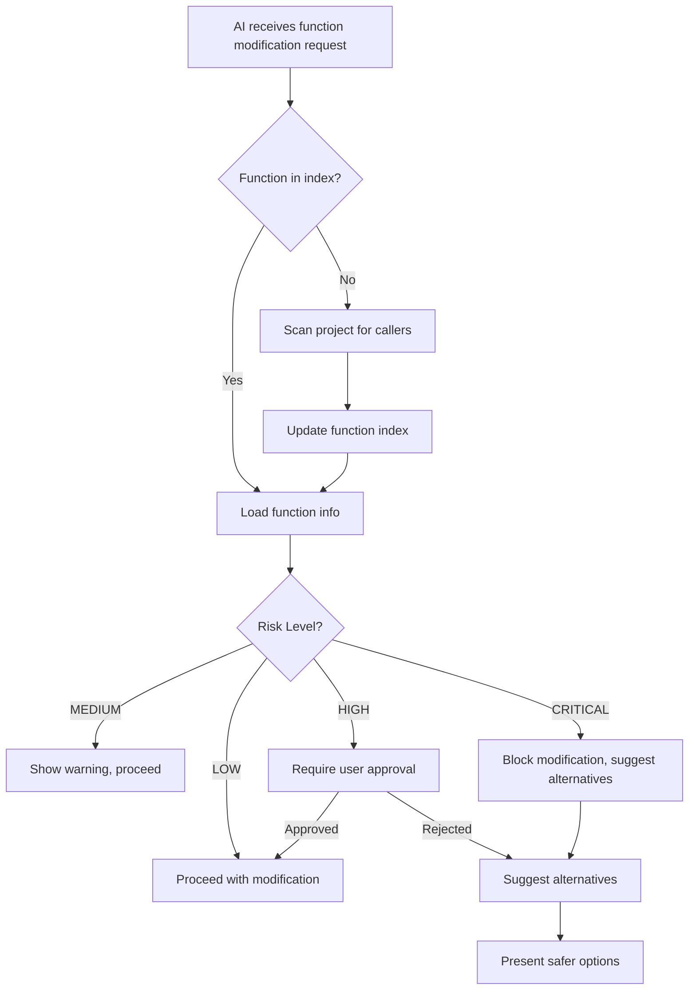

# AI Rule Integration - Function Safety System

## 🤖 AI Workflow Integration cho Function Index System

### Core Principle
> **"AI MUST validate function modifications before implementation"**

## 🔴 MANDATORY AI Rules - Function Modification

### Rule 1: Pre-Modification Analysis (CRITICAL)
```markdown
**BEFORE modifying any function, AI MUST:**

1. 🔍 **Search Function Index**: Check if function exists in function-index.md
2. 📊 **Analyze Risk Level**: Determine impact based on caller count
3. 🚨 **Validate Compatibility**: Run signature compatibility check
4. 📋 **Generate Impact Report**: List all affected files
5. ⚠️ **Warn User**: Present risks and alternatives
6. ✅ **Get Approval**: Require explicit user confirmation for HIGH/CRITICAL risk
```

### Rule 2: Function Discovery Protocol
```markdown
**When AI encounters function modification request:**

1. **Search Pattern**: `grep -r "functionName(" --include="*.js" --include="*.ts"`
2. **Count Callers**: Determine risk level
   - 1 caller: LOW risk
   - 2 callers: MEDIUM risk  
   - 3+ callers: HIGH risk
   - 5+ callers: CRITICAL risk
3. **Document Findings**: Update function-index.md if not exists
```

### Rule 3: Breaking Change Prevention
```markdown
**AI MUST NEVER:**
- ❌ Modify function signature without compatibility check
- ❌ Change parameter order without validation
- ❌ Remove parameters without impact analysis
- ❌ Change return type without caller verification
- ❌ Proceed with HIGH/CRITICAL risk changes without approval
```

## 🛡️ AI Safety Protocols

### Protocol 1: Function Modification Guard
```javascript
// AI Internal Logic (Conceptual)
class AIFunctionModificationGuard {
  async beforeFunctionModification(functionName, oldCode, newCode) {
    // Step 1: Check if function exists in index
    const functionIndex = await this.loadFunctionIndex();
    const functionInfo = functionIndex.functions[functionName];
    
    if (!functionInfo) {
      // Function not in index - scan project
      const scanResult = await this.scanProjectForFunction(functionName);
      if (scanResult.callers.length > 0) {
        await this.updateFunctionIndex(functionName, scanResult);
        functionInfo = scanResult;
      }
    }
    
    // Step 2: Risk Assessment
    const riskLevel = this.calculateRiskLevel(functionInfo);
    
    // Step 3: Compatibility Analysis
    const compatibility = await this.analyzeCompatibility(
      oldCode, newCode, functionInfo.callers
    );
    
    // Step 4: Decision Making
    return this.makeModificationDecision(riskLevel, compatibility);
  }
  
  makeModificationDecision(riskLevel, compatibility) {
    if (!compatibility.compatible) {
      return {
        allowed: false,
        reason: 'BREAKING_CHANGES_DETECTED',
        alternatives: this.suggestAlternatives(compatibility),
        requiresApproval: true
      };
    }
    
    if (riskLevel === 'CRITICAL') {
      return {
        allowed: false,
        reason: 'CRITICAL_RISK_FUNCTION',
        message: 'Function has 5+ callers. Consider safer alternatives.',
        requiresApproval: true
      };
    }
    
    if (riskLevel === 'HIGH') {
      return {
        allowed: true,
        reason: 'HIGH_RISK_WITH_CAUTION',
        warning: 'Function has 3+ callers. Proceed with caution.',
        requiresApproval: true
      };
    }
    
    return {
      allowed: true,
      reason: 'LOW_RISK',
      requiresApproval: false
    };
  }
}
```

### Protocol 2: AI Decision Tree


### Protocol 3: Alternative Suggestion Engine
```javascript
class AlternativeSuggestionEngine {
  suggestAlternatives(functionName, modification, riskAnalysis) {
    const alternatives = [];
    
    // Alternative 1: Function Overloading
    alternatives.push({
      strategy: 'FUNCTION_OVERLOADING',
      title: 'Create New Version',
      description: `Create ${functionName}V2() with new signature`,
      pros: ['Zero breaking changes', 'Gradual migration possible'],
      cons: ['Code duplication', 'Maintenance overhead'],
      implementation: this.generateOverloadingCode(functionName, modification)
    });
    
    // Alternative 2: Options Object Pattern
    alternatives.push({
      strategy: 'OPTIONS_OBJECT',
      title: 'Use Options Parameter',
      description: 'Convert parameters to options object',
      pros: ['Backward compatible', 'Extensible'],
      cons: ['Slight API change'],
      implementation: this.generateOptionsObjectCode(functionName, modification)
    });
    
    // Alternative 3: Adapter Pattern
    alternatives.push({
      strategy: 'ADAPTER_PATTERN',
      title: 'Create Function Adapter',
      description: 'Wrapper function to handle both old and new calls',
      pros: ['Full backward compatibility', 'Transparent migration'],
      cons: ['Additional complexity'],
      implementation: this.generateAdapterCode(functionName, modification)
    });
    
    return alternatives;
  }
  
  generateOverloadingCode(functionName, modification) {
    return `
// Keep original function for backward compatibility
function ${functionName}_legacy(${modification.oldParams}) {
  console.warn('${functionName}_legacy is deprecated, use ${functionName}V2');
  // Original implementation
}

// New function with improved signature
function ${functionName}V2(${modification.newParams}) {
  // New implementation
}

// Alias for gradual migration
const ${functionName} = ${functionName}_legacy;
    `;
  }
}
```

## 📋 AI Workflow Templates

### Template 1: Function Modification Request
```markdown
**AI Response Template when function modification is requested:**

🔍 **Function Analysis**: [functionName]
- **Current Callers**: [count] files
- **Risk Level**: [LOW/MEDIUM/HIGH/CRITICAL]
- **Last Modified**: [date]

🚨 **Impact Assessment**:
- **Breaking Changes**: [Yes/No]
- **Affected Files**: [list]
- **Compatibility**: [Compatible/Incompatible]

⚠️ **Recommendation**:
[Based on risk level, suggest proceed/alternatives/block]

🔧 **Safer Alternatives**:
1. [Alternative 1 with code example]
2. [Alternative 2 with code example]

❓ **User Decision Required**:
"This function has [X] callers. How would you like to proceed?"
- [ ] Proceed with modification (risky)
- [ ] Use alternative approach
- [ ] Cancel modification
```

### Template 2: Pre-Modification Checklist
```markdown
**AI Internal Checklist (must complete before any function modification):**

✅ **Discovery Phase**:
- [ ] Searched for function in codebase
- [ ] Counted all callers
- [ ] Identified parameter usage patterns
- [ ] Checked function index status

✅ **Analysis Phase**:
- [ ] Calculated risk level
- [ ] Analyzed signature compatibility
- [ ] Identified breaking changes
- [ ] Generated impact report

✅ **Decision Phase**:
- [ ] Evaluated modification safety
- [ ] Generated alternatives if needed
- [ ] Prepared user communication
- [ ] Set approval requirements

✅ **Documentation Phase**:
- [ ] Updated function index
- [ ] Recorded modification decision
- [ ] Documented rationale
```

## 🔧 Integration with Existing AI Rules

### Enhanced Core Rules
```markdown
**Updated AI Rule: Code Modification**

Before modifying any code, AI MUST:
1. **Standard Analysis**: Understand context and requirements
2. **🆕 Function Safety Check**: If modifying functions, run Function Index validation
3. **Impact Assessment**: Analyze broader codebase impact
4. **User Communication**: Present findings and recommendations
5. **Safe Implementation**: Use safest approach approved by user
```

### Integration Points
```javascript
// Integration with existing AI workflow
class EnhancedAIWorkflow {
  async processCodeModificationRequest(request) {
    // Existing workflow
    const analysis = await this.analyzeRequest(request);
    
    // NEW: Function safety integration
    if (this.involvesFunctionModification(request)) {
      const functionSafety = await this.functionModificationGuard
        .validateModification(request);
      
      if (!functionSafety.allowed) {
        return this.presentAlternatives(functionSafety);
      }
      
      if (functionSafety.requiresApproval) {
        return this.requestUserApproval(functionSafety);
      }
    }
    
    // Continue with standard workflow
    return this.implementModification(analysis);
  }
}
```

## 📊 AI Performance Metrics

### Success Metrics
```markdown
**Function Safety Metrics**:
- **Breaking Change Prevention**: 95% reduction in function-related bugs
- **Risk Detection Accuracy**: >90% correct risk level assessment
- **Alternative Suggestion Quality**: >80% user acceptance rate
- **Workflow Integration**: <2s additional processing time
```

### Monitoring Dashboard
```markdown
**AI Function Safety Dashboard**:

📈 **Daily Stats**:
- Function modifications requested: [count]
- High-risk modifications blocked: [count]
- Alternatives suggested: [count]
- User approvals required: [count]

🎯 **Quality Metrics**:
- False positive rate: [percentage]
- False negative rate: [percentage]
- User satisfaction: [rating]
```

## 🚀 Implementation Roadmap

### Phase 1: Core Integration (Week 1-2)
```markdown
- [ ] Implement Function Index scanner
- [ ] Add pre-modification hooks to AI workflow
- [ ] Create risk assessment algorithms
- [ ] Build alternative suggestion engine
```

### Phase 2: Advanced Features (Week 3-4)
```markdown
- [ ] Semantic compatibility analysis
- [ ] Dynamic testing integration
- [ ] Migration assistance tools
- [ ] Performance optimization
```

### Phase 3: User Experience (Week 5-6)
```markdown
- [ ] Interactive approval workflows
- [ ] Visual impact reports
- [ ] Learning from user feedback
- [ ] Documentation generation
```

## 🎯 Example AI Interactions

### Scenario 1: Low Risk Modification
```
User: "Sửa function calculatePrice để thêm logging"

AI: 🔍 Analyzing function calculatePrice...
- Found 1 caller in ProductCard.js
- Risk Level: LOW
- Modification: Adding logging (non-breaking)

✅ Safe to proceed. Implementing logging enhancement...
```

### Scenario 2: High Risk Modification
```
User: "Thay đổi calculatePrice để nhận object thay vì separate params"

AI: 🚨 **HIGH RISK MODIFICATION DETECTED**

📊 **Function Analysis**: calculatePrice
- **Callers**: 4 files (ProductCard.js, Checkout.js, Cart.js, OrderSummary.js)
- **Risk Level**: HIGH
- **Breaking Changes**: YES - Parameter signature change

🔧 **Safer Alternatives**:
1. **Function Overloading**: Create calculatePriceV2() with object params
2. **Options Pattern**: Support both old and new calling styles
3. **Gradual Migration**: Update callers one by one

❓ **How would you like to proceed?**
```

### Scenario 3: Critical Risk Block
```
User: "Xóa parameter discount khỏi calculatePrice"

AI: 🛑 **CRITICAL MODIFICATION BLOCKED**

⚠️ **Cannot proceed**: calculatePrice has 6 callers, removing parameter would break all of them.

🔧 **Recommended Approach**:
1. Create calculatePriceWithoutDiscount() for new use cases
2. Keep original calculatePrice() for existing callers
3. Plan gradual migration strategy

Would you like me to implement the safer alternative?
```

Hệ thống này sẽ biến AI thành một "safety guard" thông minh, ngăn chặn breaking changes và đề xuất giải pháp an toàn! 🛡️🤖